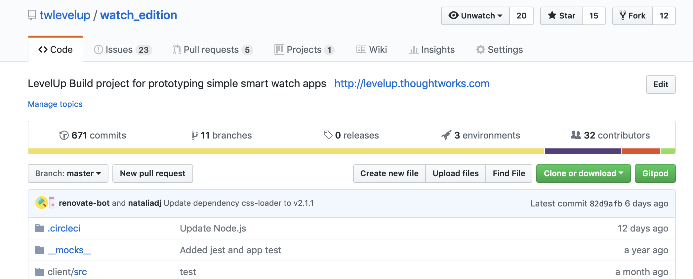

## Setting up the Development Environment 
For LevelUp, we will be using an online development environment (online Integrated Development Environment or online IDE, for short) called _Gitpod_ to build the watch app.

Gitpod is a cloud based IDE that allows teams to work on a common git 
repository. As it is cloud based, it doesn't matter what type of laptop ('development machine') you use (ie Mac vs Windows vs Linux), nor do you need to install software locally to get started. 

### Setting up Gitpod
_Note: Your trainers will provide you with the full URL for your project_
1. Add `gitpod.io#` to the start of the github link of your team's repo  
    `gitpod.io#https://github.com/twlevelup/syd-2019-s1-<teamname>`
    
    Optionally, you can download the _Gitpod_ chrome extension. This adds a link on your github repo that will 
    autommatically take you to the development environment. No typing needed!!!

    This can be downloaded from [here](https://chrome.google.com/webstore/detail/gitpod-online-ide/dodmmooeoklaejobgleioelladacbeki)

    Now when you go to your teams repo, you should see somthing like this 
    
    

2. Click `Login with Github and launch workspace`
3. Authorize _Typefox_ (the makers of gitpod), to access your github account. This allows them to 
make commits on your behalf. 
4. After this, there may be a small load time and you will be redirected to the online IDE.

### The IDE

#### The Editor (the red sqaure)
This is where you will write the actual code that controls the watch application 
#### The Terminal (the blue square)
This is where you can run commands that will test, compile and run you application. From a more technical perspective, 
this is a `bash` terminal running in a docker enviorment. Test this out by running 
`./go install`  
This command will install all the dependencies for the project.  
You will get more familiar with the terminal as you progress through the tutorials and have more some hands on experience

### The Project Explorer (the purple square)
This shows you all the files in the git repository. You will mainly be working in the `client` folder, 
but feel free to look at any of the other files. One of the amazing things about git is that is nearly 
impossible to make a change that you can't undo (as long as you don't `git push` but more on that later).
