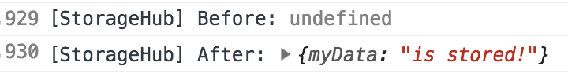

**Note!** Data saved into the storage module is not saved to disk. Any information you add to the storage after the app has started will be lost when you close the browser window.

# Initialising the watch with data on startup

1. Open `client/src/js/storage.js`, there is a hello world example in there already

2. To add more data on startup, add any of the following in `client/src/js/storage.js`:
    ```
        StorageHub.setData('myData', 'hello')
        StorageHub.setData('myData', [1, 2, 3])
        StorageHub.setData('myData', { property: [1, 2, 3] })
    ```

3. You can setData in any page or event.

4. Access the data in a page of your choice. There is an example in `homePage.js` and `contactsPage.js` already.
    ```
        const StorageHub = require('watch-framework').StorageHub;

        ...

        StorageHub.getData('myData')
    ```

5. To debug the StorageHub, you can do the following:

    ```
        StorageHub.setDebug(true)
        StorageHub.setData('myData', 'is stored!')
        StorageHub.setDebug(false)
    ```

    This will end up printing the following:
    
